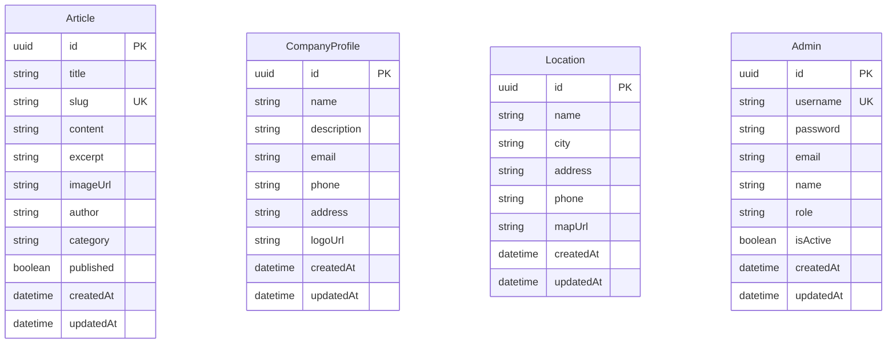
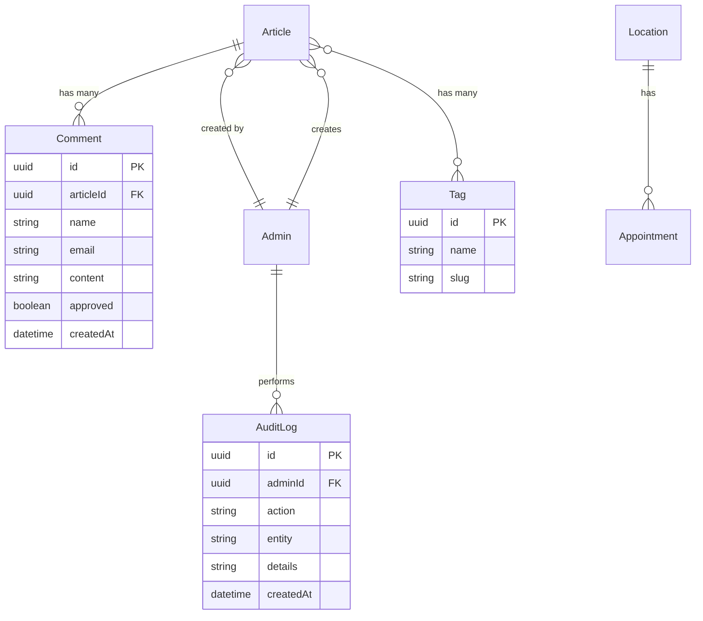

# Entity Relational Diagram (ERD)
## RAHO Club Premier - Database Schema

## 📊 ERD Diagram (Mermaid)



## 📋 Detailed Entity Descriptions

### 1. **Article** (Artikel Kesehatan)
Menyimpan semua artikel kesehatan termasuk penyakit, tindakan medis, dan kisah pasien.

| Field | Type | Constraints | Description |
|-------|------|-------------|-------------|
| **id** | UUID | PRIMARY KEY | Unique identifier |
| **title** | String | NOT NULL | Judul artikel |
| **slug** | String | UNIQUE, NOT NULL | URL-friendly identifier |
| **content** | String | NOT NULL | Konten lengkap artikel (Markdown) |
| **excerpt** | String | NULLABLE | Ringkasan singkat artikel |
| **imageUrl** | String | NULLABLE | URL gambar artikel |
| **author** | String | DEFAULT "Admin" | Nama penulis |
| **category** | String | DEFAULT "umum" | Kategori: penyakit, tindakan-medis, kisah-pasien, partnership |
| **published** | Boolean | DEFAULT false | Status publikasi |
| **createdAt** | DateTime | AUTO | Timestamp pembuatan |
| **updatedAt** | DateTime | AUTO | Timestamp update terakhir |

#### Categories:
- `penyakit` - Artikel tentang penyakit (Kolesterol, Stroke, Diabetes, dll)
- `tindakan-medis` - Artikel tentang prosedur medis (Nano Bubble, Gasotransmitter, dll)
- `kisah-pasien` - Testimoni dan pengalaman pasien
- `partnership` - Artikel tentang partnership/kerjasama

---

### 2. **CompanyProfile** (Profil Perusahaan)
Menyimpan informasi profil perusahaan RAHO Club Premier.

| Field | Type | Constraints | Description |
|-------|------|-------------|-------------|
| **id** | UUID | PRIMARY KEY | Unique identifier |
| **name** | String | NOT NULL | Nama perusahaan |
| **description** | String | NOT NULL | Deskripsi perusahaan |
| **email** | String | NULLABLE | Email kontak |
| **phone** | String | NULLABLE | Nomor telepon |
| **address** | String | NULLABLE | Alamat perusahaan |
| **logoUrl** | String | NULLABLE | URL logo perusahaan |
| **createdAt** | DateTime | AUTO | Timestamp pembuatan |
| **updatedAt** | DateTime | AUTO | Timestamp update terakhir |

#### Note:
- Biasanya hanya ada 1 record dalam tabel ini
- Digunakan untuk menampilkan informasi perusahaan di footer dan about page

---

### 3. **Location** (Lokasi Cabang)
Menyimpan informasi lokasi cabang/klinik RAHO Club Premier.

| Field | Type | Constraints | Description |
|-------|------|-------------|-------------|
| **id** | UUID | PRIMARY KEY | Unique identifier |
| **name** | String | NOT NULL | Nama lokasi/cabang |
| **city** | String | NOT NULL | Nama kota |
| **address** | String | NOT NULL | Alamat lengkap |
| **phone** | String | NULLABLE | Nomor telepon cabang |
| **mapUrl** | String | NULLABLE | Link Google Maps |
| **createdAt** | DateTime | AUTO | Timestamp pembuatan |
| **updatedAt** | DateTime | AUTO | Timestamp update terakhir |

#### Example Locations:
- Attya Reverse Aging - Jakarta Selatan
- Klinik Utama 02 - Jakarta Utara
- Raho Club Premier - Jakarta Pusat (Duta Merlin)
- Raho Club Premier - Menara Batavia
- Raho Club Premier - Bandung
- Apotek Hannah - Bali
- Attya Reverse Aging - Semarang

---

### 4. **Admin** (Administrator)
Menyimpan informasi user admin untuk mengelola sistem.

| Field | Type | Constraints | Description |
|-------|------|-------------|-------------|
| **id** | UUID | PRIMARY KEY | Unique identifier |
| **username** | String | UNIQUE, NOT NULL | Username login |
| **password** | String | NOT NULL | Password ter-hash (bcrypt) |
| **email** | String | NULLABLE | Email admin |
| **name** | String | NULLABLE | Nama lengkap admin |
| **role** | String | DEFAULT "admin" | Role: admin, superadmin, editor |
| **isActive** | Boolean | DEFAULT true | Status aktif |
| **createdAt** | DateTime | AUTO | Timestamp pembuatan |
| **updatedAt** | DateTime | AUTO | Timestamp update terakhir |

#### Roles:
- `superadmin` - Full access ke semua fitur
- `admin` - Manage articles, locations, company profile
- `editor` - Create and edit articles only

#### Default Admins:
- **admin** / admin123 (role: admin)
- **superadmin** / super123 (role: superadmin)
- **editor** / editor123 (role: editor)

---

## 🔗 Relationships

Saat ini database tidak memiliki foreign key relationships karena setiap entity berdiri sendiri:

- **Article**: Independent entity untuk artikel
- **CompanyProfile**: Single record untuk informasi perusahaan
- **Location**: Independent entity untuk lokasi cabang
- **Admin**: Independent entity untuk user management

## 📈 Future Enhancements (Optional)

Jika ingin menambahkan relasi di masa depan:



## 🔐 Security Notes

1. **Password Storage**: Passwords disimpan dengan bcrypt hashing (10 rounds)
2. **UUID**: Semua ID menggunakan UUID untuk keamanan
3. **Slug Uniqueness**: Slug artikel harus unique untuk SEO dan routing
4. **Username Uniqueness**: Username admin harus unique untuk login

## 🗂️ Indexes

Untuk performa optimal, berikut index yang direkomendasikan:

```sql
-- Already indexed by Prisma
CREATE UNIQUE INDEX "Article_slug_key" ON "Article"("slug");
CREATE UNIQUE INDEX "Admin_username_key" ON "Admin"("username");

-- Recommended additional indexes
CREATE INDEX "Article_category_idx" ON "Article"("category");
CREATE INDEX "Article_published_idx" ON "Article"("published");
CREATE INDEX "Article_createdAt_idx" ON "Article"("createdAt" DESC);
CREATE INDEX "Location_city_idx" ON "Location"("city");
CREATE INDEX "Admin_role_idx" ON "Admin"("role");
CREATE INDEX "Admin_isActive_idx" ON "Admin"("isActive");
```

## 📊 Database Statistics

| Entity | Purpose | Avg Records |
|--------|---------|-------------|
| Article | Content management | 50-200 |
| CompanyProfile | Company info | 1 |
| Location | Branch locations | 5-20 |
| Admin | User management | 3-10 |

## 🚀 Quick Commands

```bash
# View database in Prisma Studio
npx prisma studio

# Generate ERD diagram
npx prisma-erd-generator

# Migrate database
npx prisma migrate dev

# Seed database
npm run seed
```

## 📝 Schema Version

- **Database**: PostgreSQL
- **ORM**: Prisma 5.x
- **Last Updated**: June 2026
- **Schema Version**: 1.0
