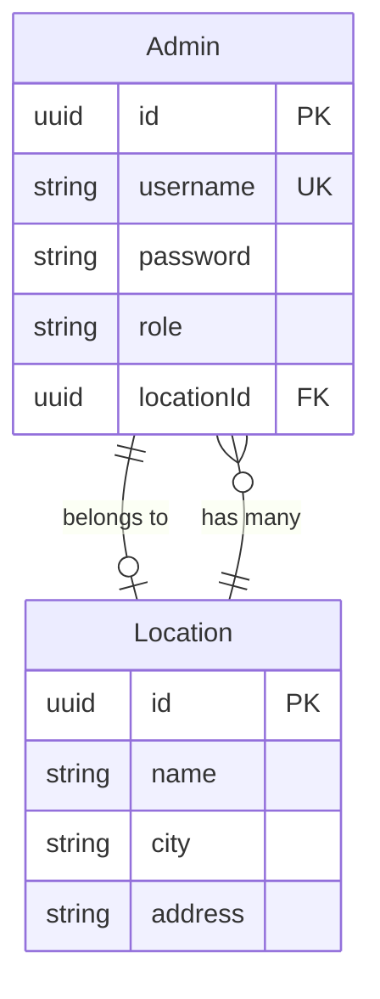

# 🏢 Multi-Branch Access Control - Proposal & Implementation

## 📋 Problem Statement

**Current Issue**: Admin tidak memiliki relasi dengan Location (cabang/klinik), sehingga:
- ❌ Superadmin tidak bisa mengatur akses per cabang
- ❌ Semua admin bisa akses semua data
- ❌ Tidak ada pembatasan berdasarkan lokasi

---

## 💡 Proposed Solutions

### **Option 1: Simple Single Branch Access** ⭐ (Recommended)

Setiap admin hanya bisa mengakses 1 cabang.

#### Database Changes

```prisma
model Admin {
  id          String   @id @default(uuid())
  username    String   @unique
  password    String
  email       String?
  name        String?
  role        String   @default("admin")
  isActive    Boolean  @default(true)
  
  // NEW FIELDS
  locationId  String?  // FK to Location (nullable for superadmin)
  location    Location? @relation(fields: [locationId], references: [id])
  
  createdAt   DateTime @default(now())
  updatedAt   DateTime @updatedAt
}

model Location {
  id          String   @id @default(uuid())
  name        String
  city        String
  address     String
  phone       String?
  mapUrl      String?
  
  // NEW RELATION
  admins      Admin[]  // One location can have many admins
  
  createdAt   DateTime @default(now())
  updatedAt   DateTime @updatedAt
}
```

#### Access Rules

```typescript
// Superadmin: locationId = null (access all branches)
// Admin: locationId = specific branch (access only that branch)
// Editor: locationId = specific branch (edit only that branch)
```

---

### **Option 2: Advanced Multiple Branch Access**

Setiap admin bisa mengakses multiple cabang.

#### Database Changes

```prisma
model Admin {
  id          String   @id @default(uuid())
  username    String   @unique
  password    String
  email       String?
  name        String?
  role        String   @default("admin")
  isActive    Boolean  @default(true)
  
  // NEW RELATION
  locations   AdminLocation[]  // Many-to-many via junction table
  
  createdAt   DateTime @default(now())
  updatedAt   DateTime @updatedAt
}

model Location {
  id          String   @id @default(uuid())
  name        String
  city        String
  address     String
  phone       String?
  mapUrl      String?
  
  // NEW RELATION
  admins      AdminLocation[]  // Many-to-many via junction table
  
  createdAt   DateTime @default(now())
  updatedAt   DateTime @updatedAt
}

// NEW JUNCTION TABLE
model AdminLocation {
  id          String   @id @default(uuid())
  adminId     String
  locationId  String
  
  admin       Admin    @relation(fields: [adminId], references: [id], onDelete: Cascade)
  location    Location @relation(fields: [locationId], references: [id], onDelete: Cascade)
  
  createdAt   DateTime @default(now())
  
  @@unique([adminId, locationId])
  @@index([adminId])
  @@index([locationId])
}
```

---

## 📊 Comparison Table

| Feature | Option 1 (Simple) | Option 2 (Advanced) |
|---------|-------------------|---------------------|
| **Complexity** | Low ⭐ | High |
| **Implementation Time** | 1-2 days | 3-5 days |
| **Database Changes** | 1 FK field | 1 new table + 2 relations |
| **Migration Risk** | Low | Medium |
| **Flexibility** | One branch per admin | Multiple branches per admin |
| **Use Case** | Most businesses | Large enterprises |
| **Maintenance** | Easy | Complex |
| **Performance** | Fast | Moderate (join overhead) |

---

## 🎯 Recommendation

**Choose Option 1 (Simple Single Branch Access)** because:

✅ **Sufficient for current needs** - Most admins manage one branch  
✅ **Easy to implement** - Just add one FK field  
✅ **Low risk** - Minimal schema changes  
✅ **Better performance** - No junction table joins  
✅ **Easier to understand** - Clear ownership model  
✅ **Can upgrade later** - Can migrate to Option 2 if needed  

---

## 🚀 Implementation Plan (Option 1)

### **Phase 1: Database Schema Update**

#### Step 1: Create Migration

```bash
cd backend
npx prisma migrate dev --name add_location_to_admin
```

#### Step 2: Update schema.prisma

```prisma
model Admin {
  id          String   @id @default(uuid())
  username    String   @unique
  password    String
  email       String?
  name        String?
  role        String   @default("admin")
  isActive    Boolean  @default(true)
  
  // ADD THESE LINES
  locationId  String?
  location    Location? @relation(fields: [locationId], references: [id])
  
  createdAt   DateTime @default(now())
  updatedAt   DateTime @updatedAt
  
  // ADD THIS INDEX
  @@index([locationId])
}

model Location {
  id          String   @id @default(uuid())
  name        String
  city        String
  address     String
  phone       String?
  mapUrl      String?
  
  // ADD THIS LINE
  admins      Admin[]
  
  createdAt   DateTime @default(now())
  updatedAt   DateTime @updatedAt
}
```

---

### **Phase 2: Backend API Updates**

#### Update Auth Controller

```typescript
// backend/src/controllers/authController.ts

// Login - Include location info
export const login = async (req: Request, res: Response) => {
  const admin = await prisma.admin.findUnique({
    where: { username },
    include: {
      location: true, // Include location data
    },
  });
  
  const token = jwt.sign(
    {
      id: admin.id,
      role: admin.role,
      locationId: admin.locationId, // Include in JWT
    },
    JWT_SECRET
  );
  
  res.json({
    admin: {
      ...admin,
      password: undefined,
    },
    token,
  });
};
```

#### Create Location Access Middleware

```typescript
// backend/src/middleware/locationAccess.ts

export const checkLocationAccess = (req: Request, res: Response, next: NextFunction) => {
  const user = req.user; // From auth middleware
  const requestedLocationId = req.params.locationId || req.body.locationId;
  
  // Superadmin can access all locations
  if (user.role === 'superadmin') {
    return next();
  }
  
  // Other roles must match their assigned location
  if (user.locationId !== requestedLocationId) {
    return res.status(403).json({
      error: 'Access denied. You can only access your assigned location.',
    });
  }
  
  next();
};
```

#### Update Article Controller (Example)

```typescript
// backend/src/controllers/articleController.ts

// Get articles filtered by location
export const getArticles = async (req: Request, res: Response) => {
  const user = req.user;
  
  const where: any = {};
  
  // If not superadmin, filter by location
  if (user.role !== 'superadmin' && user.locationId) {
    where.locationId = user.locationId;
  }
  
  const articles = await prisma.article.findMany({ where });
  
  res.json(articles);
};
```

---

### **Phase 3: Frontend Updates**

#### Update Admin Interface

```typescript
// frontend/src/types/index.ts

export interface Admin {
  id: string;
  username: string;
  email?: string;
  name?: string;
  role: 'superadmin' | 'admin' | 'editor';
  isActive: boolean;
  locationId?: string; // NEW
  location?: Location;  // NEW
}
```

#### Update Admin Context

```typescript
// frontend/src/hooks/useAuth.ts

const [admin, setAdmin] = useState<Admin | null>(null);
const [locationId, setLocationId] = useState<string | null>(null); // NEW

useEffect(() => {
  const adminData = localStorage.getItem('admin');
  if (adminData) {
    const parsed = JSON.parse(adminData);
    setAdmin(parsed);
    setLocationId(parsed.locationId); // NEW
  }
}, []);
```

#### Add Location Selector (Superadmin Only)

```tsx
// frontend/src/components/admin/LocationSelector.tsx

export default function LocationSelector() {
  const { admin } = useAuth();
  const [locations, setLocations] = useState<Location[]>([]);
  const [selectedLocation, setSelectedLocation] = useState<string>('all');
  
  // Only show for superadmin
  if (admin?.role !== 'superadmin') return null;
  
  return (
    <div className="location-selector">
      <select
        value={selectedLocation}
        onChange={(e) => setSelectedLocation(e.value)}
      >
        <option value="all">All Locations</option>
        {locations.map(loc => (
          <option key={loc.id} value={loc.id}>
            {loc.name} - {loc.city}
          </option>
        ))}
      </select>
    </div>
  );
}
```

---

### **Phase 4: Admin Management UI**

#### Superadmin Can Assign Location

```tsx
// frontend/src/app/admin/users/create/page.tsx

export default function CreateAdminPage() {
  const [formData, setFormData] = useState({
    username: '',
    password: '',
    email: '',
    name: '',
    role: 'admin',
    locationId: '', // NEW
  });
  
  return (
    <form>
      {/* ... other fields ... */}
      
      {/* Location Selection */}
      <div>
        <label>Assigned Location</label>
        <select
          name="locationId"
          value={formData.locationId}
          onChange={handleChange}
        >
          <option value="">No Location (Superadmin)</option>
          {locations.map(loc => (
            <option key={loc.id} value={loc.id}>
              {loc.name} - {loc.city}
            </option>
          ))}
        </select>
      </div>
      
      <button type="submit">Create Admin</button>
    </form>
  );
}
```

---

## 📝 Migration SQL

### Automatic (via Prisma)

```bash
npx prisma migrate dev --name add_location_to_admin
```

### Manual (if needed)

```sql
-- Add locationId column to Admin table
ALTER TABLE "Admin" 
ADD COLUMN "locationId" UUID;

-- Add foreign key constraint
ALTER TABLE "Admin" 
ADD CONSTRAINT "Admin_locationId_fkey" 
FOREIGN KEY ("locationId") 
REFERENCES "Location"("id") 
ON DELETE SET NULL;

-- Add index for performance
CREATE INDEX "Admin_locationId_idx" ON "Admin"("locationId");
```

---

## 🧪 Testing Plan

### Test Cases

1. **Superadmin Access**
   - ✅ Can view all locations
   - ✅ Can manage all admins
   - ✅ Can assign admins to locations
   - ✅ locationId = null

2. **Admin with Location**
   - ✅ Can only view own location data
   - ✅ Cannot access other locations
   - ✅ locationId = specific branch

3. **Admin without Location**
   - ✅ Treated as limited access
   - ✅ Or require location assignment

4. **Location Change**
   - ✅ Superadmin can reassign admin to different location
   - ✅ Access updates immediately

---

## 🔐 Security Considerations

### Access Control Rules

```typescript
// Role-Based Access Control (RBAC)

const accessRules = {
  superadmin: {
    locations: 'all',
    articles: 'all',
    admins: 'all',
  },
  admin: {
    locations: 'own',
    articles: 'own-location',
    admins: 'none',
  },
  editor: {
    locations: 'own',
    articles: 'own-location',
    admins: 'none',
  },
};
```

### Middleware Chain

```typescript
// Protect routes
router.get('/articles', 
  authenticate,           // Check if logged in
  checkLocationAccess,    // Check location permission
  getArticles             // Controller
);
```

---

## 📊 Updated ERD

### New Relationship Diagram



---

## 🎯 Benefits of Implementation

✅ **Better Security** - Data isolation per branch  
✅ **Scalability** - Ready for multi-branch growth  
✅ **Clear Ownership** - Each admin owns one branch  
✅ **Audit Trail** - Track who manages which branch  
✅ **Flexibility** - Superadmin manages all  
✅ **Performance** - Simple FK relationship  

---

## 📅 Implementation Timeline

| Phase | Duration | Effort |
|-------|----------|--------|
| **Phase 1: Database** | 1 day | 4 hours |
| **Phase 2: Backend** | 1 day | 6 hours |
| **Phase 3: Frontend** | 1 day | 6 hours |
| **Phase 4: Admin UI** | 1 day | 4 hours |
| **Testing** | 1 day | 4 hours |
| **Total** | **5 days** | **24 hours** |

---

## 🔄 Rollback Plan

If issues occur:

1. **Database**: Keep old schema, add new fields as nullable
2. **Backend**: Feature flag to enable/disable
3. **Frontend**: Conditional rendering based on feature flag

```typescript
// Feature flag example
const MULTI_BRANCH_ENABLED = process.env.ENABLE_MULTI_BRANCH === 'true';
```

---

## 📚 Documentation Updates

After implementation, update:

1. **ERD Documentation** - Add new relationship
2. **API Documentation** - New endpoints and params
3. **Admin Guide** - How to assign locations
4. **Security Policy** - Access control rules

---

## ✅ Acceptance Criteria

- [ ] Admin schema updated with locationId
- [ ] Location schema updated with admins relation
- [ ] Migration tested successfully
- [ ] Backend middleware implemented
- [ ] Frontend UI for location assignment
- [ ] Superadmin can assign locations
- [ ] Admin can only access own location
- [ ] Tests passing
- [ ] Documentation updated
- [ ] Deployed to staging

---

## 🎓 Future Enhancements (Phase 2)

After Option 1 is stable, consider:

1. **Multi-location Access** - Upgrade to Option 2
2. **Location-based Permissions** - Fine-grained control
3. **Branch Analytics** - Per-location statistics
4. **Location Settings** - Branch-specific configurations
5. **Transfer Requests** - Admin request location change

---

## 💰 Cost-Benefit Analysis

### Costs
- Development: 24 hours
- Testing: 4 hours
- Documentation: 2 hours
- **Total**: 30 hours

### Benefits
- Better security and data isolation
- Scalable for business growth
- Clear branch ownership
- Improved audit capabilities
- Professional enterprise feature

**ROI**: High - Essential feature for multi-branch business

---

## 📞 Questions & Support

### Common Questions

**Q: What happens to existing admins?**  
A: They will have `locationId = null`, need manual assignment

**Q: Can we upgrade to multi-location later?**  
A: Yes, Option 1 can migrate to Option 2

**Q: Performance impact?**  
A: Minimal - just one extra FK join

**Q: Backward compatible?**  
A: Yes - nullable field, existing admins still work

---

## 🎉 Conclusion

**Recommendation**: Implement **Option 1 (Simple Single Branch Access)**

This will provide:
- ✅ Essential multi-branch access control
- ✅ Easy to implement and maintain
- ✅ Low risk and fast deployment
- ✅ Foundation for future enhancements

---

**Status**: 📋 Proposal - Awaiting Approval  
**Priority**: 🔴 High - Important business feature  
**Effort**: 🟡 Medium - 5 days implementation  
**Risk**: 🟢 Low - Minimal schema changes
